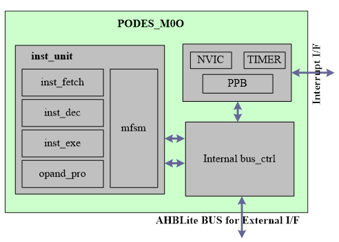
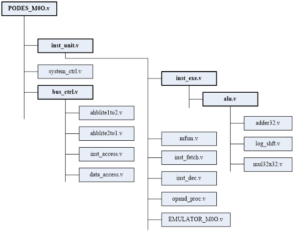

# PODES

**PODES**是**P**rocessor **O**ptmization for **D**eeply **E**mbedded **S**ystem的首字母缩写。包括传统的51指令集架构，SparcV8指令集架构，ARMv6-M指令集架构以及PIC-16指令集架构等一系列MCU Core。 
**PODES-M0O** 是兼容于ARMv6-M指令集架构的开源版本。**M0**指代Cortex-M0，**O**指代Open Source。 
 
## PODES-M0O特性
PODES-M0O指令集设计参照ARMv6-M Architecture Reference Manual文档实现。PODES-M0O的功能模块设计参照Cortex-M0 generic user guide和Cortex-m0 technical reference manual两个文档实现。 
PODES-M0O完全兼容Cortex-M0内核。为了更清楚地表明“兼容”的含义，下面不支持的Features，对比说明。
- Debug功能不支持 
内核评估可以不需要这个功能，ROM版本ASIC实现也不需要这个功能。 
- Hints指令不支持（SEV, WFI, WFE, YIELD） 
这四条指令执行有标志信号引出，用户在低功耗或者多处理器设计中可以使用这些信号。如果代码中有这些指令，PODES-M0O会当成NOP执行。指令流水不会停止。 
- Cortex –M0的可配置特性 
PODES-M0O本身源代码开源，用户可以任意修改配置。没有必要提供功能配置选项，人为把代码搞复杂。 
- 乘法器和加法器使用行为模型实现 
ASIC综合或者FPGA综合可以直接调用工艺库提供的宏单元，或者用户自己设计结构化代码。 
 
## PODES-M0O功能框图
PODES-M0O采用三级流水结构。指令处理单元分为取指，译码和执行三个模块。流水线控制、数据相关、结构相关、分支转移、exception插入等控制都统一由主状态机完成。 
PODES-M0O的系统控制包括NVIC，System-tick Timer以及PPB空间寄存器三个部分。PPB空间中与Debug功能相关的寄存器没有实现。 
PODES-M0O提供AHBLite 总线接口、32个IRQ和1个NMI中断输入。外部功能模块可以使用AMBA总线连接到PODES-M0O。 

 

## PODES-M0O代码结构
全部PODES-M0O代码都采用工艺无关的RTL描述(VerilogHDL-2001)，具有较好的可读性。模块层次结构如下图。 

 

## 使用方式
请参考项目中的PODES_M0O_Implementation_User_Manual_V1p2 文档。
 

## 贡献

1. 直接代码贡献请从 master 创建你的分支。 
2. 新的需求或者建议请留言，我会评估并处理。 
3. 如果你修改了或者增加了代码，请提供对应的文档。 
4. 确保代码风格一致 (尽量参考原始代码风格)。 
5. 如果你想资助这个项目，请参考[README_PODES](./README_PODES.md) 

## 许可

LGPL
